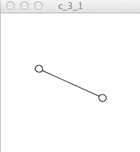

# 振動

# 角度
Processingにおいて「角度」とは何かを理解する必要がある。

## 度数とラジアン
度数とラジアンという角度の概念がある。

### 度数
角度を表す数値のこと。

半回点は180度、1回転は360度、90度（直角）は360度の1/4の角度のことであり、度数で表した角度は直感的に分かりやすい。

### ラジアン
円の半径と円の弧の長さの比率によって定義される角度の単位のこと。

1ラジアンは、その比率が1（弧の長さ=円の半径）である角度を指す。180度=PIラジアン、360度は2*PIラジアン、90度=PI/2ラジアンのように洗わせる。

Processingでは角度を表すのにラジアンを指定する必要がある。

### 度数からラジアンに変換する式
度数からラジアンに変換する式は以下のようなものになる

```processing
ラジアン = 2 * PI * (度数 / 360);
```

そのため、processingで60度回転させたい場合は以下のようになる。

```processing
60度のラジアン = 2 * PI * (60 / 360);
```

`radians()`という関数を利用すれば、より簡単に度数を変換できる。


```processing
60度のラジアン = radians(60);
```

そのため、以下の出力は同じ

```processing
float deg = 60;
float angle;

angle = PI * 2 * (deg / 360);
println(angle); // => 1.0471976

angle = radians(deg);
println(angle); // => 1.0471976
```

### `PI`
上記のコードで記述した、Processingの組み込み変数`PI`は円周率（パイ:π)のこと。

## `rotate()`を利用した角運動（座標の回転）

以下は度数をラジアンに変換し、`rotate()`の引数に渡しているコード。

**chapter_3/c_3_1/c_3_1.pde**

```processing
float deg = 0;
float angle = 0;
float velocity = 1;
float acceleraion = 0.01;

void setup() {
    size( 200, 200);
    smooth();
}

void draw() {
    background(255);
    
    // 度数に速度を加算
    deg += velocity;

    // 度数をラジアンに変換
    angle = radians(deg);

    // 座標を移動
    translate(width / 2, height / 2);
    rotate(angle);

    // 描画する
    line(-50, 0, 50, 0);
    ellipse(-50, 0, 10, 10);
    ellipse(50, 0, 10, 10);

    // 速度に加速度を加算
    velocity += acceleraion;
}

```

以下のアニメーションが出力される。

